# Hostel Management Portal

## React JS

- Go to `React JS/firstapp`
- Install dependencies - `npm install`
- Start a React App - `npm start`
- React App runs in port - 3000

## Node JS

- Go to `React JS/firstapp`
- Configure `.env` file by adding your MySQL Database name and Password
- Install dependencies - `npm install`
- Start the server - `node app.js`
- Node runs in port - 8080

## Screenshots

### LOGIN PAGE
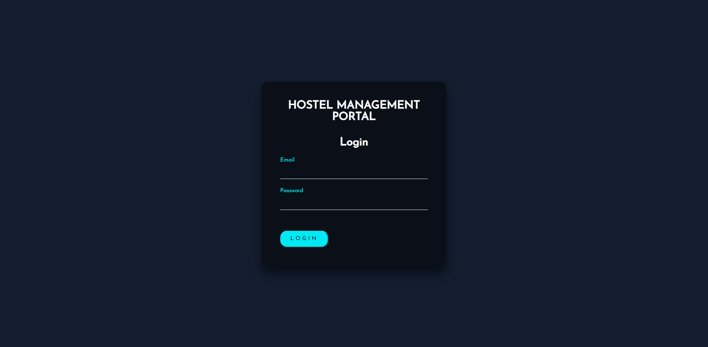 

### ADMIN's FUNCTIONALITIES
1. ADD CAMPUS AND COURSES
 
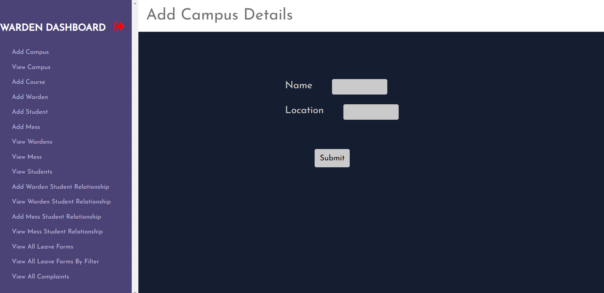 
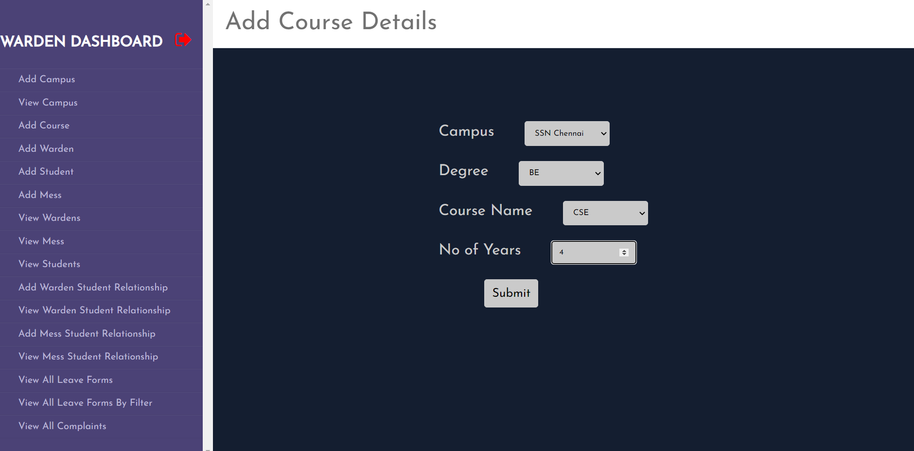  

2. VIEW, EDIT AND DELETE CAMPUS AND COURSE DETAILS
 
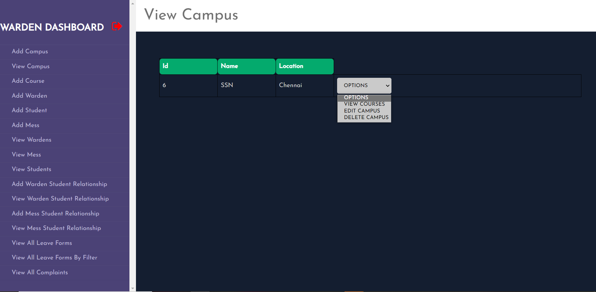 
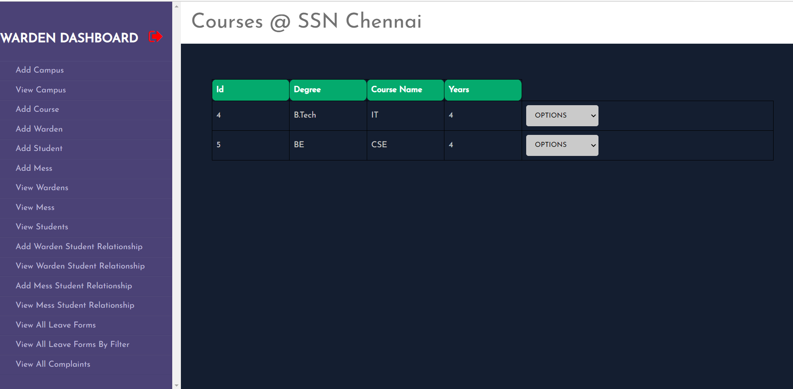  

3. ADD USERS
 
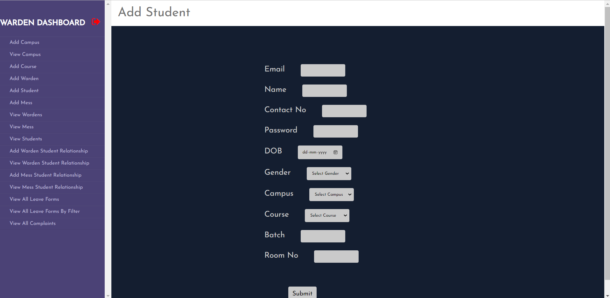 
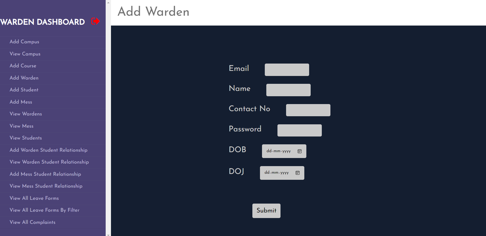  

4. VIEW, EDIT AND DELETE USERS
 
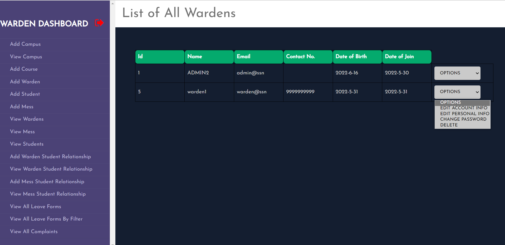 
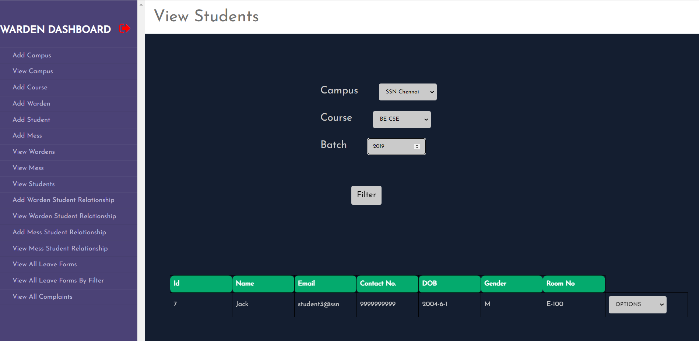  

5. MAP A SPECIFIC WARDEN TO SPECIFIC SET OF STUDENTS (LEAVE REQUEST AND COMPLAINTS ARE SENT ONLY TO THEM)
 
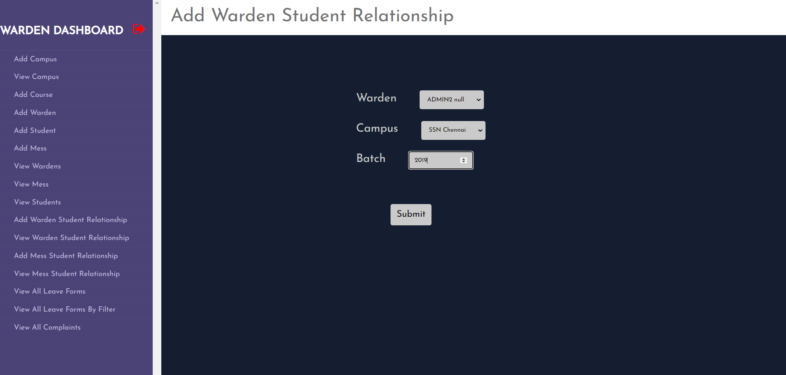 
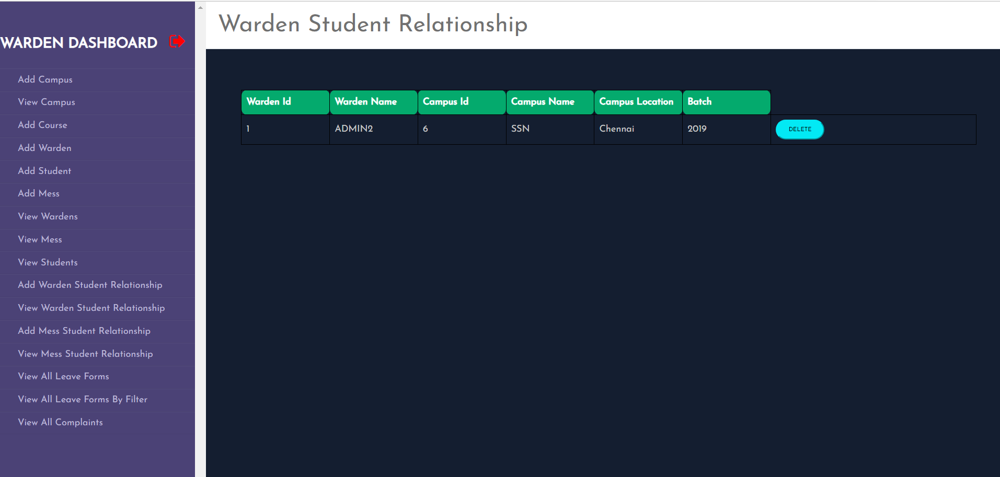  

6. VIEW AND PROCESS LEAVE FORM REQUESTS
 
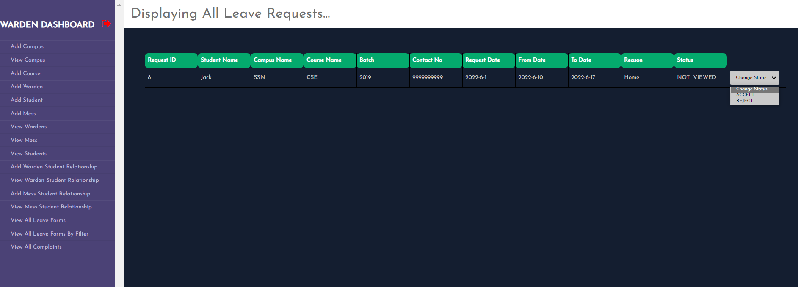  

7. VIEW COMPLAINTS
 
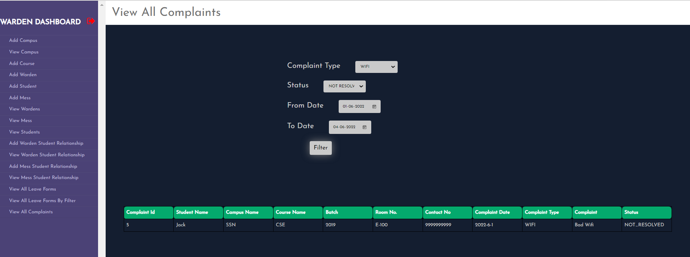  